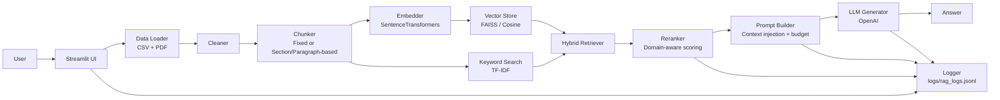

# Architecture

Name: Hansen Donkor  
Index Number: 10012200059

## Overview
This system is a **manual Retrieval-Augmented Generation (RAG)** chatbot implemented without LangChain/LlamaIndex.

Exam constraint (explicit): **All RAG components are implemented manually** (loading, cleaning, chunking, indexing, retrieval, reranking, prompt assembly, logging, evaluation). The only external AI call is the final **generation** step (OpenAI).

Data sources:
- **Election results (CSV)** → structured records converted into readable text documents
- **Budget statement (PDF)** → unstructured text extracted per page

## End-to-End Flow
User Query → Retrieval → Reranking → Context Selection → Prompt → LLM → Response

## Component Diagram (Mermaid)

## Data Model
Two core dataclasses (in `src/utils.py`) keep the pipeline explicit and gradeable:
- **Document**: raw loaded text + metadata (e.g., PDF page number, CSV row fields)
- **Chunk**: smaller units used for retrieval, each with a stable `chunk_id` and metadata preserved from the parent document

This makes it easy to cite evidence, trace errors, and log what the system actually used.

## Pipeline Stages (Manual RAG)

### 1) Data Ingestion
- CSV (`data/Ghana_Election_Result.csv`): each row is formatted into readable text and stored as a `Document(source="csv")`.
- PDF (`data/2025_Budget_Statement.pdf`): text is extracted (page-by-page) and stored as `Document(source="pdf")`.
- Implementation: `src/data_loader.py`

### 2) Cleaning / Normalization
Cleaning is applied before chunking to reduce noise and improve retrieval:
- remove repeated boilerplate / headers where possible
- normalize whitespace
- fix common PDF artifacts (e.g., hyphenation)

Implementation: `src/cleaner.py`

### 3) Chunking (Two Strategies)
Two chunking modes are supported (selectable in the UI):
- **fixed**: fixed-size character windows with overlap for recall
- **section**: paragraph/section-aware packing to preserve semantic boundaries in the PDF

Each chunk gets a stable `chunk_id` and carries metadata (source/page/row/section labels) for traceability.

Implementation: `src/chunker.py`

### 4) Dense Vector Indexing
- Each chunk is embedded using `sentence-transformers`.
- Embeddings are L2-normalized so cosine similarity reduces to inner product.
- Stored in FAISS (`IndexFlatIP`) when available; otherwise a NumPy fallback is used.

Implementation: `src/embedder.py`, `src/vector_store.py`

### 5) Keyword Indexing (TF‑IDF)
To support exact term and number lookups, the same chunk texts are indexed with TF‑IDF.

Implementation: `src/keyword_search.py`

### 6) Hybrid Retrieval
The query runs through both retrievers:
- Dense top-$k$ from the vector store
- TF‑IDF top-$k$ from the keyword store

Scores are min-max scaled to $[0,1]$ independently, then merged by chunk index.

Implementation: `src/retriever.py`

### 7) Reranking (Innovation)
Candidates are reranked with a domain-aware score:

$$
	ext{final\_score} = 0.60\cdot \text{vector} + 0.25\cdot \text{keyword} + 0.15\cdot \text{domain\_match}
$$

Domain match is derived from simple query keyword classification (election vs budget) and the chunk source (`csv` vs `pdf`).

Implementation: `src/reranker.py`

### 8) Prompt Assembly + Context Budgeting
The prompt builder:
- injects selected chunk texts as the only allowed evidence
- adds citations derived from chunk metadata (PDF page, CSV row/region/constituency)
- enforces a context budget (approx token counting)
- forces a safe fallback: if evidence is missing, answer exactly: “I don't know based on the provided documents.”

Implementation: `src/prompt_builder.py`

### 9) Generation (OpenAI)
The final prompt is sent to the OpenAI Chat Completions API.
- This is the only external AI call.
- Errors (missing key, API failures) are handled and surfaced to the UI.

Implementation: `src/generator.py`

### 10) Logging + Evaluation
- **Logging:** each query writes a JSONL event with retrieved chunks (text + metadata), scores, selected context, prompt, and answers.
- **Evaluation:** an evaluation harness runs predefined and adversarial queries, and compares RAG vs a “pure LLM” baseline.

Implementation: `src/logger.py`, `src/evaluator.py`

## Implementation Mapping (Code Evidence)
- **Core dataclasses:** `src/utils.py`
- **Data Loader:** `src/data_loader.py`
- **Cleaner:** `src/cleaner.py`
- **Chunker (2 strategies):** `src/chunker.py`
- **Embedder:** `src/embedder.py`
- **Vector Store (FAISS):** `src/vector_store.py`
- **Keyword Search (TF‑IDF):** `src/keyword_search.py`
- **Hybrid Retriever:** `src/retriever.py`
- **Custom Reranker (innovation):** `src/reranker.py`
- **Prompt Builder:** `src/prompt_builder.py`
- **LLM Generator:** `src/generator.py`
- **Logger:** `src/logger.py`
- **Evaluation runner:** `src/evaluator.py`
- **UI (full pipeline):** `app.py`

## Logging
Each query is logged to `logs/rag_logs.jsonl` with:
- timestamp
- query
- retrieved chunks (text + metadata) and similarity scores
- selected context
- final prompt
- final answer (RAG) + optional pure LLM baseline
